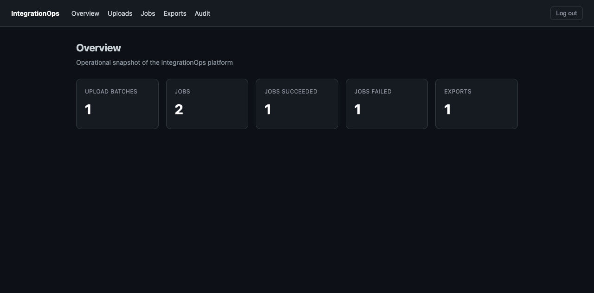
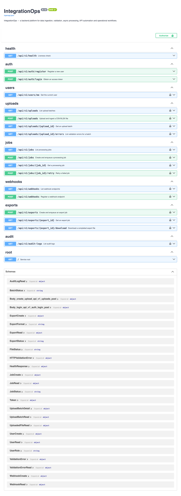
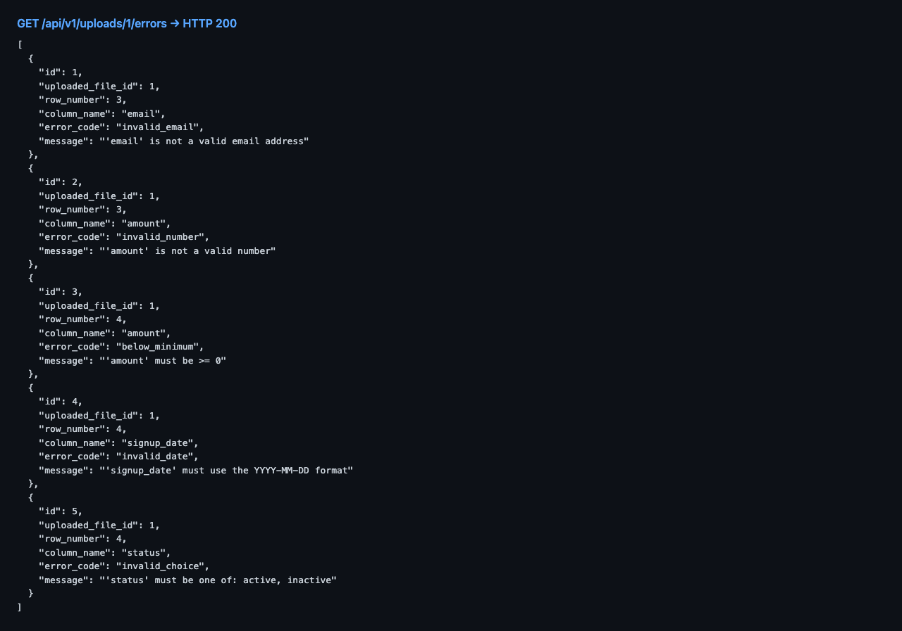
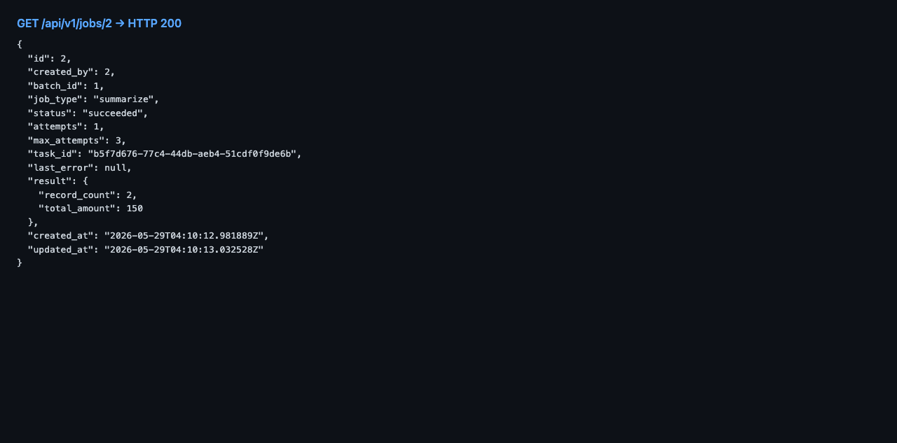
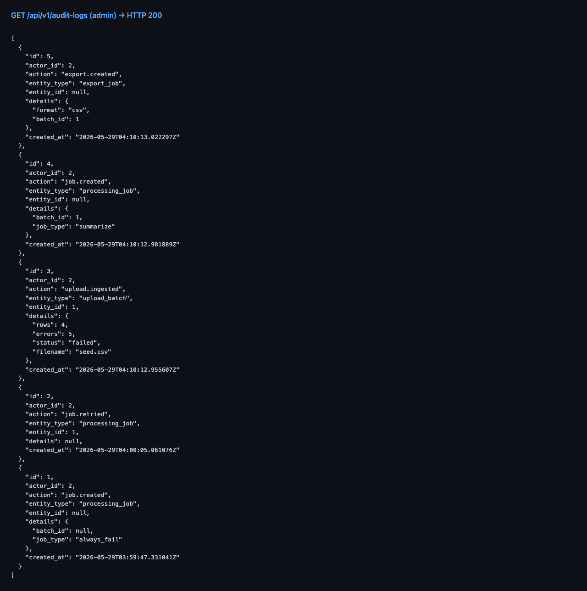
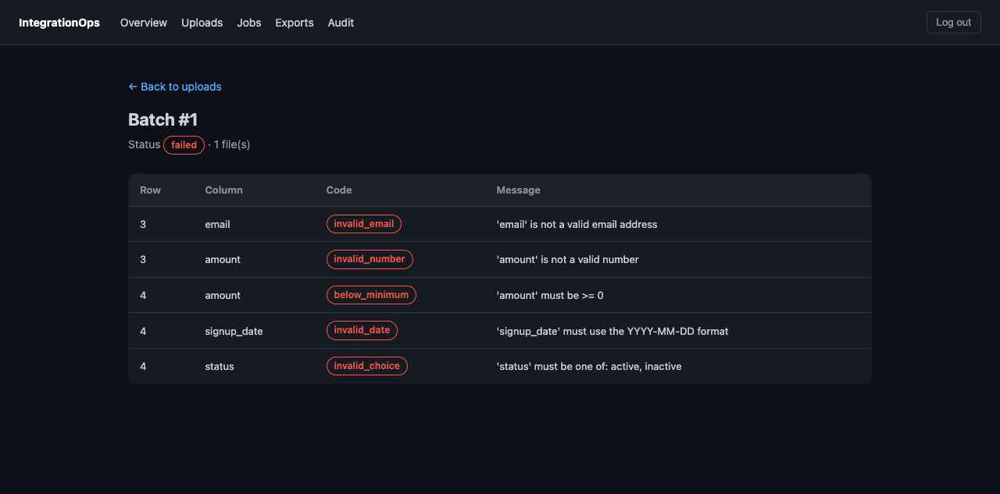
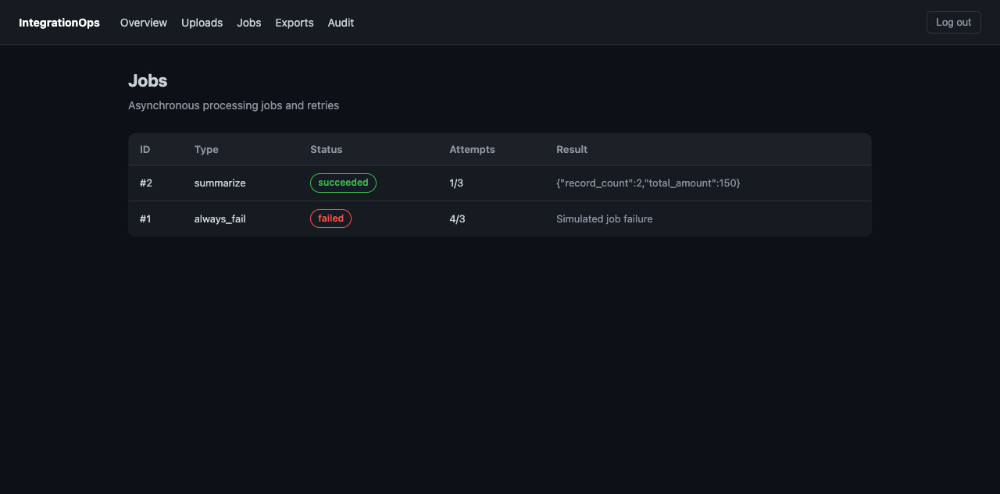

# IntegrationOps

[](https://github.com/Arcan17/integrationops/actions/workflows/ci.yml)
[](https://www.python.org/downloads/)
[](https://fastapi.tiangolo.com)
[](LICENSE)

> Production-style Python backend for data ingestion, async job processing, signed webhooks and operational audit trails.



A realistic internal company platform: upload messy CSV/XLSX data, validate it row-by-row, run async Celery jobs, export results and receive HMAC-signed webhook notifications — all with JWT auth, RBAC and a full audit log.

## What it demonstrates

| Capability | Implementation | Detail |
|---|---|---|
| **Async job processing** | Celery + Redis | Bounded retries, status tracking, cancellation |
| **HMAC-signed webhooks** | SHA-256 signature header | Per-attempt delivery records, retry on failure |
| **Row-level validation** | Pydantic schemas | Structured error reporting per row |
| **RBAC + JWT auth** | FastAPI + PyJWT | admin / operator / viewer roles |
| **Audit trail** | PostgreSQL | Every significant action logged with actor + timestamp |
| **Full-stack dashboard** | Next.js + TypeScript | Uploads, jobs, exports, audit log views |
| **CI/CD + testing** | GitHub Actions + pytest | 100+ tests, zero external dependencies in CI |

---

## Features

- JWT authentication with role-based access control (`admin` / `operator` / `viewer`)
- CSV/XLSX upload with declarative, row-level validation and structured error reporting
- Clean records persisted to PostgreSQL; raw files processed in memory
- Async processing jobs (Celery + Redis) with status tracking and bounded retries
- Signed (HMAC-SHA256) webhook notifications with per-attempt delivery records
- CSV/XLSX exports of validated data
- Operational audit log for every significant action
- Dockerized stack, Alembic migrations, pytest suite and GitHub Actions CI

## Tech stack

| Area | Technology |
|---|---|
| Language | Python 3.12 |
| Web framework | FastAPI |
| Database | PostgreSQL + SQLAlchemy 2.0 + Alembic |
| Async jobs | Celery + Redis |
| Packaging / runtime | Docker + Docker Compose |
| Testing & CI | pytest + GitHub Actions |
| API docs | OpenAPI (Swagger UI) |

## Architecture (target)

```
app/
  main.py            # FastAPI entrypoint
  core/config.py     # Typed settings (Pydantic)
  api/v1/            # Versioned API routers
  db/                # Session & base (Phase 2)
  models/            # SQLAlchemy models (Phase 2)
  schemas/           # Pydantic schemas
  services/          # Business logic (ingestion, validation, exports...)
  workers/           # Celery tasks (Phase 5)
tests/               # pytest suite (Phase 7)
docs/                # Architecture & operational docs (Phase 8)
```

## Screenshots

**OpenAPI / Swagger UI** — the full API surface (auth, uploads, jobs, webhooks, exports, audit):



**Structured validation errors** — `GET /api/v1/uploads/{id}/errors`:



**Async job result** — `GET /api/v1/jobs/{id}` (processed by the Celery worker):



**Operational audit log** — `GET /api/v1/audit-logs` (admin):



## API endpoints

| Method | Path | Description | Role |
|---|---|---|---|
| GET | `/api/v1/health` | Liveness check | public |
| POST | `/api/v1/auth/register` | Register a user (default `viewer`) | public |
| POST | `/api/v1/auth/login` | Obtain a JWT access token | public |
| GET | `/api/v1/users/me` | Current user profile | authenticated |
| POST | `/api/v1/uploads` | Upload & ingest a CSV/XLSX file | operator |
| GET | `/api/v1/uploads` | List upload batches | authenticated |
| GET | `/api/v1/uploads/{id}` | Get a batch with its files | owner / admin |
| GET | `/api/v1/uploads/{id}/errors` | List validation errors for a batch | owner / admin |
| POST | `/api/v1/jobs` | Create & enqueue a processing job | operator |
| GET | `/api/v1/jobs` | List processing jobs | owner / admin |
| GET | `/api/v1/jobs/{id}` | Get job status & result | owner / admin |
| POST | `/api/v1/jobs/{id}/retry` | Retry a failed job | operator |
| POST | `/api/v1/webhooks` | Register a webhook endpoint | operator |
| GET | `/api/v1/webhooks` | List webhook endpoints | owner / admin |
| POST | `/api/v1/exports` | Create & enqueue a CSV/XLSX export | operator |
| GET | `/api/v1/exports/{id}` | Get export job status | owner / admin |
| GET | `/api/v1/exports/{id}/download` | Download a completed export | owner / admin |
| GET | `/api/v1/audit-logs` | Query operational audit logs | admin |

Full interactive docs (OpenAPI / Swagger UI) at `/docs` when running.

## Run locally (Docker)

```bash
cp .env.example .env
docker compose up --build
```

- API: http://localhost:8000
- Swagger UI: http://localhost:8000/docs
- Health check: http://localhost:8000/api/v1/health

### Bootstrap an admin user

```bash
make create-admin email=admin@example.com password=secret123
```

A full curl walkthrough (upload → job → export) is in
[docs/local-setup.md](docs/local-setup.md).

## Run locally (without Docker)

```bash
python -m venv .venv && source .venv/bin/activate
pip install -r requirements.txt
uvicorn app.main:app --reload
```

## Database migrations (Alembic)

```bash
# Apply migrations (inside the api container or a local venv with DATABASE_URL set)
alembic upgrade head

# Create a new revision from model changes
alembic revision --autogenerate -m "describe change"
```

## Data validation

Uploaded rows are validated against a declarative schema in
`app/services/validation.py`. The default business-record schema:

| Column | Required | Rule |
|---|---|---|
| `external_id` | yes | non-empty, max 64 chars |
| `email` | yes | valid email (normalized to lowercase) |
| `amount` | yes | number ≥ 0 |
| `signup_date` | no | `YYYY-MM-DD` |
| `status` | no | one of `active`, `inactive` |

Valid rows are stored in `data_records`; failures are recorded in
`validation_errors` and exposed via `GET /api/v1/uploads/{id}/errors`.
Uploads are limited to `.csv` / `.xlsx` and `MAX_UPLOAD_SIZE_BYTES` (default 5 MB).

## Webhooks, exports & audit

- **Webhooks** — register endpoints subscribed to events (`upload.ingested`,
  `job.succeeded`, …). Deliveries run async via Celery and are signed with
  HMAC-SHA256 in the `X-IntegrationOps-Signature` header (verify with the
  endpoint secret).
- **Exports** — `POST /api/v1/exports` queues a CSV/XLSX export of a batch's
  clean records; poll `GET /api/v1/exports/{id}` and download via
  `GET /api/v1/exports/{id}/download`.
- **Audit logs** — every significant operation is recorded and queryable at
  `GET /api/v1/audit-logs` (admin only).

## Dashboard (Next.js)

A lightweight **Next.js + TypeScript** dashboard lives in [`frontend/`](frontend/).
It consumes the existing API (no backend logic duplicated) and makes the platform
easy to understand visually. Pages: **Login**, **Overview** (metrics), **Uploads**,
**Validation errors**, **Jobs**, **Exports** (with downloads), and **Audit logs**.

Run it locally (with the API already running):

```bash
cd frontend
cp .env.local.example .env.local   # point NEXT_PUBLIC_API_URL at your API
npm install
npm run dev                        # http://localhost:3000
```

> The API enables CORS for `http://localhost:3000` (configurable via `CORS_ORIGINS`).

**Overview**


**Validation errors view**



**Jobs**



## Testing

```bash
pip install -r requirements-dev.txt
pytest
```

- **Unit tests** (validation, parsing, security, webhook signing) run with no
  external services.
- **Integration tests** (auth → upload → job → export) require a reachable
  PostgreSQL (`DATABASE_URL`) and run Celery in eager mode; they are skipped
  automatically when no database is available.

CI runs on GitHub Actions ([.github/workflows/ci.yml](.github/workflows/ci.yml)):
it spins up PostgreSQL + Redis, validates Alembic migrations (`upgrade` +
`downgrade`), and runs the full test suite.

## Roadmap

- [x] **Phase 1** — Backend skeleton (FastAPI, config, health, Docker Compose)
- [x] **Phase 2** — Database models & Alembic migrations
- [x] **Phase 3** — JWT authentication & role-based access control
- [x] **Phase 4** — CSV/XLSX ingestion & validation
- [x] **Phase 5** — Celery/Redis async jobs & retries
- [x] **Phase 6** — Webhooks, exports & audit logs
- [x] **Phase 7** — Tests & CI
- [x] **Phase 8** — Documentation & deploy readiness

## Documentation

- [Architecture](docs/architecture.md) — components, layers, data model, key flows
- [Local setup](docs/local-setup.md) — run the stack and a full API walkthrough
- [Deployment](docs/deployment.md) — production checklist and configuration
- [Screenshots](docs/screenshots.md) — what to capture for the portfolio
