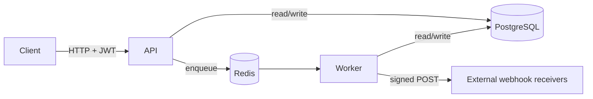

# IntegrationOps — Architecture

IntegrationOps is a backend platform for ingesting messy business data,
validating it, processing it asynchronously, and exposing operational
controls (jobs, retries, exports, webhooks, audit logs).

## Components

| Component | Responsibility |
|---|---|
| **API** (FastAPI + Uvicorn) | HTTP API, authentication, RBAC, request validation, OpenAPI docs |
| **Worker** (Celery) | Async job processing, retries, webhook delivery, export generation |
| **PostgreSQL** | System of record (users, batches, records, jobs, audit, webhooks, exports) |
| **Redis** | Celery broker and result backend |



## Layered structure

```
app/
  api/v1/      # HTTP routers + dependencies (auth, RBAC)
  core/        # config (typed settings) and security (JWT, hashing)
  db/          # engine, session, declarative base
  models/      # SQLAlchemy 2.0 ORM models
  schemas/     # Pydantic request/response models
  services/    # business logic (ingestion, validation, jobs, webhooks, exports, audit)
  workers/     # Celery app + tasks
```

The API layer stays thin: routers validate input and delegate to **services**,
which hold the business logic and are reused by both the API and the worker.

## Data model

| Table | Purpose |
|---|---|
| `users` | Accounts with an RBAC role (`admin` / `operator` / `viewer`) |
| `upload_batches` | A group of files uploaded together |
| `uploaded_files` | A single uploaded file and its status |
| `validation_errors` | Per-row/column validation failures |
| `data_records` | Validated, normalized rows (JSONB payload) |
| `processing_jobs` | Async jobs with status, attempts and result |
| `audit_logs` | Immutable operational event trail |
| `webhook_endpoints` | Registered webhook URLs + signing secret |
| `webhook_deliveries` | Per-attempt delivery records |
| `export_jobs` | CSV/XLSX export requests and output paths |

## Key flows

### Upload ingestion
1. `POST /uploads` (operator) receives a CSV/XLSX file.
2. The file is validated (extension, size, encoding) and parsed in memory.
3. Each row is validated against the declarative schema.
4. Valid rows → `data_records`; failures → `validation_errors`.
5. Batch/file statuses are updated, an audit event is recorded, and a
   `upload.ingested` webhook event is emitted.

### Async job + retry
1. `POST /jobs` creates a `processing_job` and enqueues a Celery task.
2. The worker runs the job (e.g. `summarize`), updating status and `result`.
3. On failure, the task retries up to `max_attempts` (`retrying` → `failed`).
4. `POST /jobs/{id}/retry` re-enqueues a failed job.
5. Success emits a `job.succeeded` webhook event.

### Webhook delivery
- Events fan out to active endpoints subscribed to the event type.
- Each delivery is a Celery task performing a signed (`HMAC-SHA256`) POST and
  recording the response status.

## Design decisions

- **Services over fat controllers** — logic is testable and shared with the worker.
- **Domain-agnostic records** — validated rows are stored as JSONB so the
  validation schema can change without migrations.
- **Eager Celery in tests** — jobs run synchronously for deterministic testing.
- **Typed settings** — all configuration flows through `core/config.py`; no
  secrets are hardcoded.
